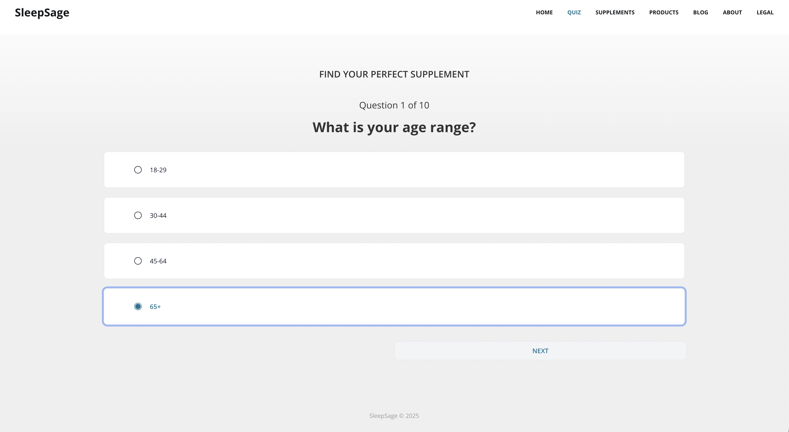
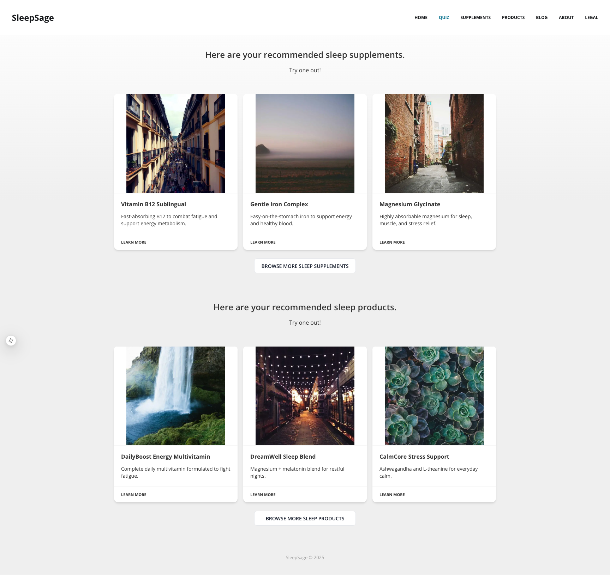
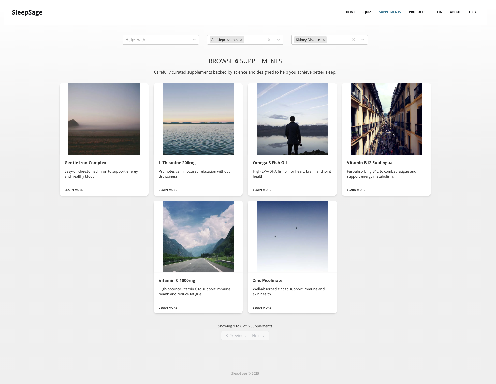
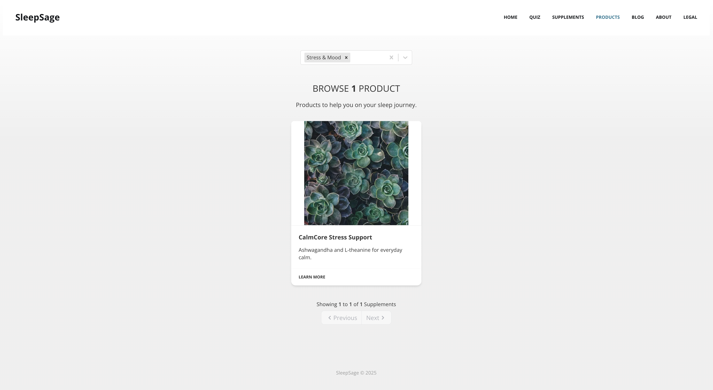

<p align="center">
  
</p>

# SleepSage

SleepSage is a personalized supplement recommendation platform. A user answers a short
quiz about their symptoms, lifestyle, and health profile, and the app recommends a tailored
set of supplements and products — while filtering out anything that could conflict with their
current medications or health conditions.

Under the hood, the recommendation engine maps **symptoms → ingredients → supplements**. When
a user reports symptoms like fatigue or trouble sleeping, the service finds ingredients known to
help, then surfaces the supplements that contain them. Crucially, it also runs an exclusion pass:
any ingredient that interacts with a medication the user is taking (e.g. anticoagulants,
antidepressants) or that carries a risk for one of their conditions (e.g. pregnancy, kidney
disease) is filtered out before recommendations are made.

This repository is a **monorepo** containing the full stack: a Go API service that powers the
recommendation logic, the main quiz/results web app, a marketing landing page, an account area,
an informational site, and a shared header/footer component library used across the frontends.

## Screenshots

| The quiz | Personalized results |
| --- | --- |
|  |  |

| Browse supplements (with conflict filters) | Browse products |
| --- | --- |
|  |  |

## How it works

1. **Quiz** — The user answers questions covering demographics (age, gender, weight), symptom
   frequency, current medications (interactions), and health conditions (risks).
2. **Matching** — The API translates symptom answers into target ingredients, then resolves those
   ingredients to the supplements that contain them.
3. **Exclusion** — Ingredients that interact with the user's medications or pose a risk for their
   conditions are removed from consideration.
4. **Results** — The user receives a curated set of recommended supplements and products, and the
   submission is saved so it can be revisited.

## Repository structure

| Directory | Stack | Description |
| --- | --- | --- |
| `supplement-suggester-service` | Go | REST API and recommendation engine — quiz, supplement/product matching, and submissions. |
| `supplement-suggester-ui` | Next.js | The main app: quiz, results, and supplement/product browsing. |
| `landing-page-ui` | Next.js | Marketing landing page and questionnaire entry point. |
| `account-ui` | Next.js | User account pages (Supabase-backed auth). |
| `info-ui` | Vite + React | Informational/content site. |
| `header-footer-ui` | React (npm package) | Shared `@sleep-sage/header-footer` component library consumed by the frontends. |

## Tech stack

- **Backend:** Go, PostgreSQL (via `database/sql` + `lib/pq`), OpenAI API
- **Frontends:** Next.js (App Router), React, TypeScript, Tailwind CSS, Vite
- **Database migrations:** [goose](https://github.com/pressly/goose)

## Local development

### Prerequisites

- Go 1.23+
- Node.js 20+
- PostgreSQL 16

### 1. Database

Create a local database and load the schema with seed data:

```bash
createdb sss
psql -d sss -f supplement-suggester-service/db/local_schema_seed.sql
```

> `local_schema_seed.sql` provisions the full schema and a set of realistic sample data
> (supplements, ingredients, symptoms, quiz questions, products) so the app is fully functional
> locally without any external database.

### 2. API service

```bash
cd supplement-suggester-service
# .env:
#   DATABASE_URL="postgres://<user>@localhost:5432/sss?sslmode=disable"
#   OPENAI_API_KEY="..."   # only needed for AI-assisted features
go run ./main.go           # serves on http://localhost:8080
```

### 3. Frontends

Each frontend is a standalone app. For the main suggester UI:

```bash
cd supplement-suggester-ui
# .env:
#   NEXT_PUBLIC_SUGGESTER_SERVICE_API_URL="http://localhost:8080"
npm install
npm run dev                # serves on http://localhost:3000
```

The other frontends (`landing-page-ui`, `account-ui`, `info-ui`) follow the same pattern
(`npm install && npm run dev`).

## Environment & secrets

Configuration is supplied via `.env` files, which are git-ignored and never committed. Each app
documents the variables it needs in the snippets above.
